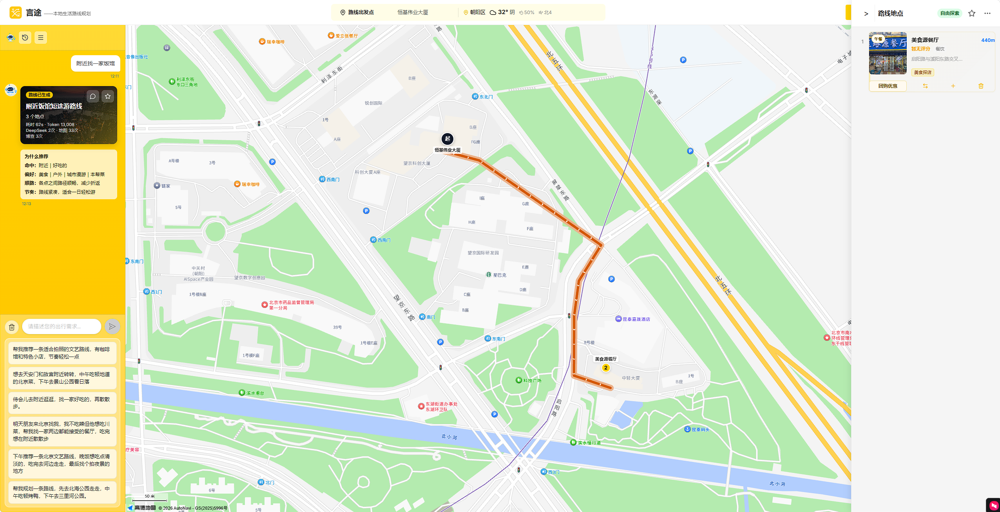
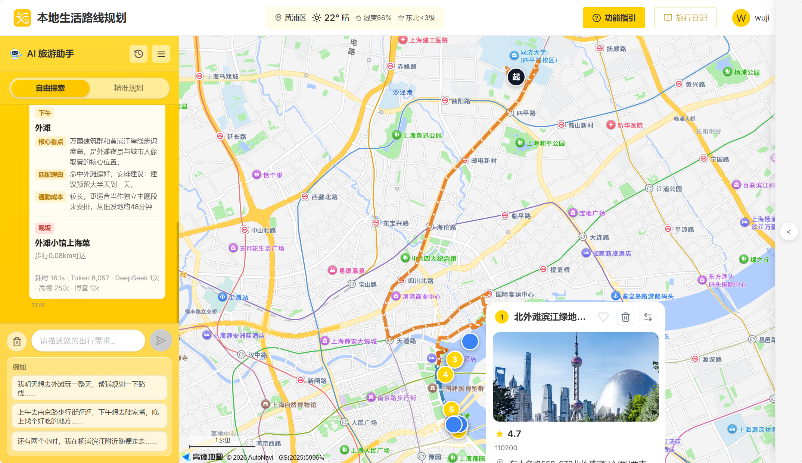
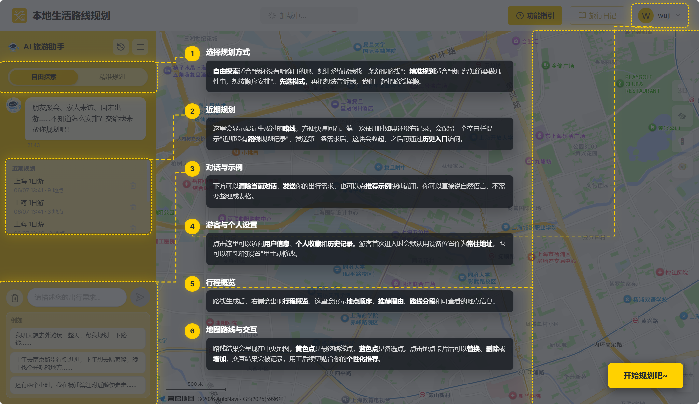
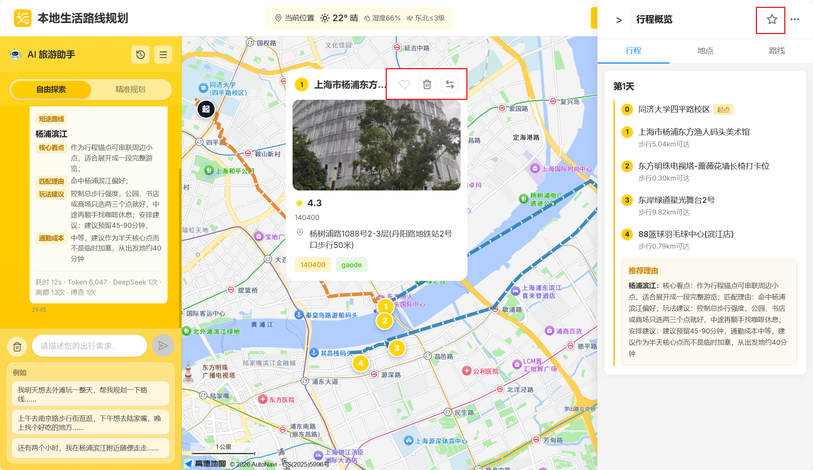
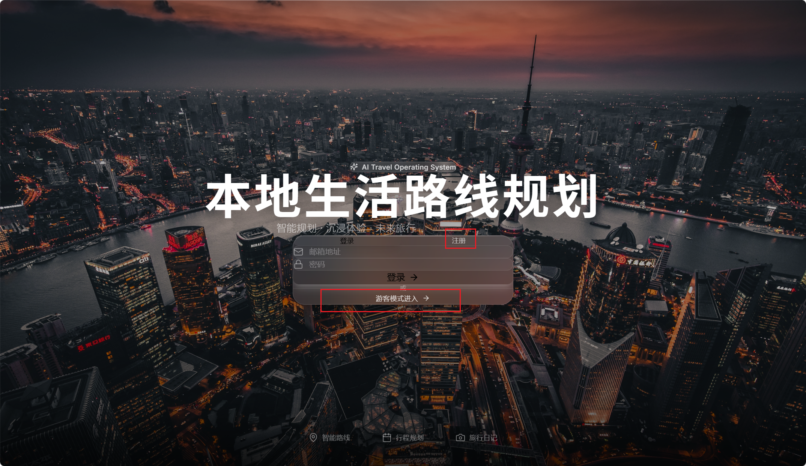
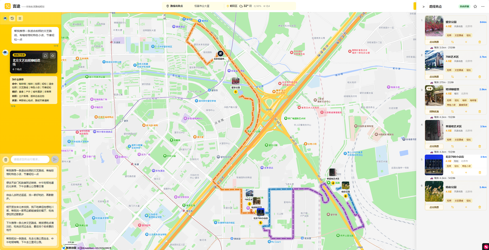
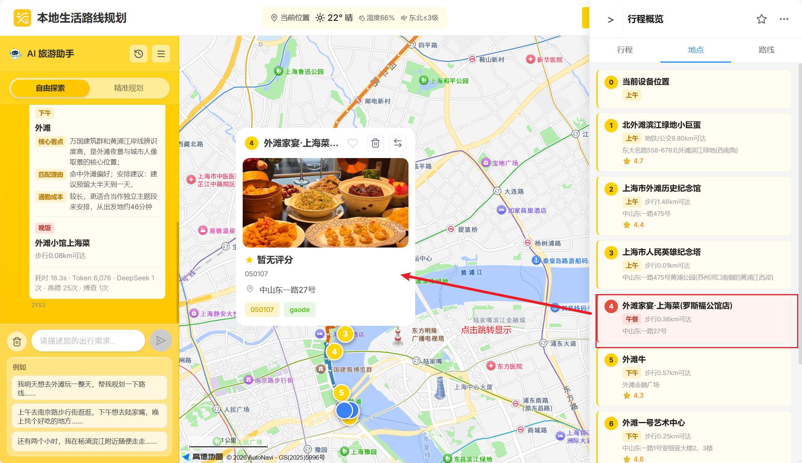
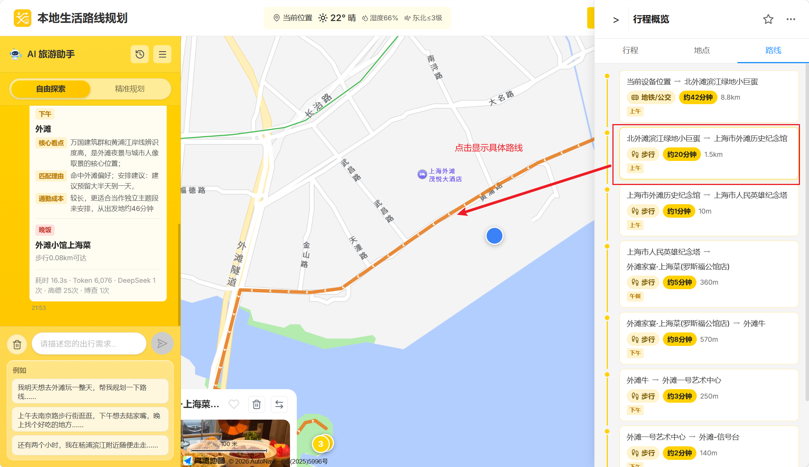

# 言途 —— 本地生活路线规划项目说明文档

> **当前版本信息（2026-07-14）**
>
> | 项目项 | 当前状态                                                                                       |
> |--------|--------------------------------------------------------------------------------------------|
> | GitHub 仓库 | https://github.com/wujithebest/MEITUAN-travel-planner-deploy                               |
> | 主线分支 | `master`                                                                                   |
> | 当前版本提交 | `0e01477`：固定路线使用高德实际道路折线                                                                   |
> | 线上部署 | 前端（CloudBase 静态托管）https://meituan-travel-planner-d243c7271-1320524552.tcloudbaseapp.com；后端（CloudBase 云托管 / CloudRun）https://meituan-travel-planner-281308-9-1320524552.sh.run.tcloudbase.com |
> | 本地部署 | Docker Compose，前端 `80`，后端 `8000`，MongoDB `27017`，Redis `6379`                              |
>
> 线上环境变量需要分别配置前端高德 JS API Key、后端高德 Web 服务 Key、LLM、博查、和风天气、MongoDB、Redis 和 JWT 密钥。不要将真实密钥提交到 GitHub。

<u>***<font color="blue">游客和登录用户均可设置路线出发点。已保存的手动地址或设备地址优先作为路线起点，刷新后继续沿用；只有在没有有效地址时才读取设备位置，定位失败后使用兜底地址。</font>***</u>

**目录**

- [0. 当前版本与快速启动](#0-当前版本与快速启动)
- [1. 项目介绍](#1-项目介绍)
  - [1.1 项目背景](#11-项目背景)
    - [应用场景示例](#应用场景示例)
    - [交付目标对应说明](#交付目标对应说明)
    - [性能与特色](#性能与特色)
- [2. 前端介绍与数据库实现](#2-前端介绍与数据库实现)
  - [2.1 前端交互流程](#21-前端交互流程)
  - [2.2 前端特色](#22-前端特色)
  - [2.3 数据库设计](#23-数据库设计)
  - [2.4 前端界面展示](#24-前端界面展示)
- [3. 后端路线规划算法实现](#3-后端路线规划算法实现)
  - [3.1 总体架构](#31-总体架构)
  - [3.2 意图解析模块](#32-意图解析模块)
  - [3.3 POI 检索与筛选](#33-poi-检索与筛选)
  - [3.4 路线规划引擎](#34-路线规划引擎)
  - [3.5 结果生成与格式化](#35-结果生成与格式化)
  - [3.6 多轮对话 Pipeline：上下文分类与局部重规划机制](#36-多轮对话-pipeline上下文分类与局部重规划机制)
  - [3.7 固定演示路线快照与高德道路缓存](#37-固定演示路线快照与高德道路缓存)
- [4. 成本计算与迭代指标](#4-成本计算与迭代指标)
  - [4.1 单轮对话成本计算](#41-单轮对话成本计算)
  - [4.2 迭代指标体系](#42-迭代指标体系)
- [5. 后续版本迭代计划](#5-后续版本迭代计划)
- [6. 总结](#6-总结)

---

## 0. 当前版本与快速启动

### 0.1 Docker Compose 启动

项目根目录的 `docker-compose.yml` 会启动前端、后端、MongoDB 和 Redis。先在根目录准备 `.env`，至少配置后端调用所需的高德、LLM、博查、天气、数据库和 `SECRET_KEY` 变量，然后执行：

```bash
docker compose up -d --build
```

访问地址：

| 服务 | 地址 |
|------|------|
| 前端 | http://localhost/ 或 http://localhost/app |
| 后端健康检查 | http://localhost:8000/api/health |
| 后端 API 文档 | http://localhost:8000/docs |

停止服务：

```bash
docker compose down
```

### 0.2 本地开发启动

后端依赖位于 `backend/requirements.txt`，前端依赖位于 `frontend/package.json`。后端开发端口为 `8000`，前端 Vite 开发端口为 `3006`：

```bash
# 后端
cd backend
pip install -r requirements.txt
python run.py

# 新终端启动前端
cd frontend
npm install
npm run dev
```

前端生产构建和后端语法检查：

```bash
npm --prefix frontend run build
python -m compileall -q backend
```

### 0.3 固定测试用例

左侧栏的六个推荐用例使用固定路线快照。点击按钮后，前端请求 `/api/meituan/fixed-routes/{fixture_id}`，直接加载仓库中的 JSON，不调用 LLM、博查、高德搜索或完整路线规划 Pipeline，因此适合演示和回归测试。

## 1. 项目介绍

### 1.1 项目背景

本项目对应赛题“现在就出发：AI本地路线智能规划”。赛题任务背景为：解决用户出行时多目的地串联的决策负担，利用大语言模型结合高德 POI 与路线数据、博查网络内容语义和用户个性偏好，自动生成可执行的个性化路线方案。赛题交付目标包括：

| 交付目标                  | 要求                                               |
| ------------------------- | -------------------------------------------------- |
| 交付目标1：路线生成       | 根据用户意图自动串联多个 POI，生成完整路线安排     |
| 交付目标2：多条件与个性化 | 满足差异化条件约束，结合用户历史偏好生成差异化方案 |

当前本地生活出行存在明显的决策成本。用户在“周末朋友聚会”“半天随便逛逛”“回家前办几件事”“下班后顺路吃饭”等场景中，往往需要同时处理地点搜索、评分筛选、距离判断、营业场景匹配、交通衔接和时间预算等问题。传统地图和点评类产品提供大量信息，但用户仍需要自行筛选、比较和排序，容易出现信息过载、路线绕行、POI 与真实需求不匹配等问题。

本项目的价值定位是：将用户的自然语言需求转化为可执行的路线方案。系统通过 LLM 意图解析、高德地图 POI 与路线 API、博查网络内容语义增强、用户画像和历史反馈记录，实现从“模糊出行想法”到“可视化路线结果”的自动化闭环。当前博查主要用于宏观主题语义增强和候选发现，具体 POI 的逐条评论聚合仍属于待增强能力。

### 1.2 项目概述

系统名称为“言途”。一句话定义：这是一个面向本地即时出行场景的 AI 路线规划系统，支持自由探索与精准规划两种模式，能够根据自然语言输入自动完成模糊语义理解、意图冲突处理、POI 检索、路线串联、地图渲染、偏好记录和多轮路线调整。

项目当前采用前后端分离架构：前端基于 React、TypeScript、Vite、Ant Design 与高德地图 JS API；后端基于 FastAPI、MongoDB、Redis、DeepSeek/OpenAI 兼容接口、博查 API 和高德 Web 服务 API；线上使用腾讯云 CloudBase 静态托管（前端）、CloudBase 云托管（CloudRun，后端）、数据库 MongoDB Atlas，本地使用 Docker Compose。

#### 应用场景示例

以下示例与前端左侧栏当前的六个固定用例一致。点击用例会从固定快照加载结果，统一从“北京恒基伟业大厦”出发。固定快照统一配置为 6 个主 POI 和 4 个备选点，用于演示和回归测试；普通动态路线会按用户意图、时间预算和可行性校验自适应生成点位数量。

| 用户输入 | 系统输出示例 |
|----------|--------------|
| 帮我推荐一条适合拍照的文艺路线，有咖啡馆和特色小店，节奏轻松一点 | 生成北京文艺拍照咖啡路线，按望京公园、798 艺术区、地球咖啡馆、草场地艺术区、北京 798 小店街、将府公园组织 6 个主 POI，并展示拍照、文艺路线、咖啡馆、特色小店、节奏轻松等逐点标签。 |
| 想去天安门和故宫附近转转，中午吃顿地道的北京菜，下午去景山公园看日落 | 生成北京天安门故宫景山一日游，遵循天安门 → 故宫 → 午餐 → 景山公园 → 万春亭的时间顺序，包含 6 个主 POI 和 4 个备选 POI。 |
| 待会儿去附近逛逛，找一家好吃的，再散散步。 | 生成北京恒基伟业大厦附近逛吃散步路线，围绕北小河公园、望京 SOHO、餐厅、望京公园、望京小街和北小河沿岸步道安排 6 个主 POI，并保持“附近、逛逛、好吃、散步”的主题。 |
| 明天朋友来北京找我，我不吃辣但他想吃川菜，帮我找一家两边都能接受的餐厅，吃完想在附近散散步 | 生成北京附近口味兼容短途游，优先安排兼容双方口味的餐厅，再衔接望京 SOHO、望京公园和北小河公园等餐后散步点，保留 6 个主 POI 和 4 个备选 POI。 |
| 下午推荐一条北京文艺路线，晚饭想吃点清淡的，吃完去河边走走，最后找个拍夜景的地方 | 生成北京文艺河边夜景路线，按 798 艺术区 → 将府公园 → 清淡晚餐 → 亮马河水岸 → 蓝色港湾 → 夜景观景点编排，确保河边散步和拍夜景出现在对应时段。 |
| 帮我规划一条路线，先去北海公园走走，中午吃顿烤鸭，下午去三里河公园。 | 生成北京北海公园烤鸭三里河公园一日游，遵循北海公园内部游览 → 烤鸭午餐 → 前往三里河公园 → 三里河水岸步道的顺序，包含 6 个主 POI 和 4 个备选 POI。 |

截图预留：



图示说明：此处建议插入精准规划模式下“日料店→回家”路线结果，展示左侧对话、中央地图路线和右侧行程概览。



图示说明：此处建议插入自由探索模式下外滩游览、餐饮推荐的完整路线结果。

#### 交付目标对应说明

交付目标1：路线生成。系统通过“意图解析 → POI 检索 → 路线规划 → 时序编排 → 前端渲染”的链路，将自然语言输入转换为有序 POI 列表和真实交通路线。自由探索模式偏向根据用户兴趣生成路线；精准规划模式偏向严格按用户给出的任务顺序执行，例如“先买水果，再吃饭，最后回家”。

交付目标2：多条件与个性化。系统支持时间预算、出发位置、常住地址、餐饮偏好、活动偏好、人均预算、历史喜欢/不喜欢/删除记录等约束。注册用户的偏好、路线收藏和历史规划存储于 MongoDB；游客模式使用浏览器 localStorage 存储近期规划和收藏。POI 交互会被记录为偏好反馈，用于后续推荐排序。

#### 性能与特色

动态路线生成耗时受 LLM、博查和高德 API 网络状况影响，SSE 请求最长等待时间由后端限制为 300 秒；固定测试用例直接读取本地快照，通常无需等待外部路线规划。系统的三项核心亮点是模糊语义理解、意图冲突处理和多轮对话调整，同时支持偏好记录、游客模式、实时天气展示、地图路线可视化、POI 卡片交互、路线收藏与历史记录。

其他特色包括：

| 特色               | 说明                                              |
| ------------------ | ------------------------------------------------- |
| 自由探索模式       | 适合用户只有大致方向或时间预算的场景              |
| 精准规划模式       | 适合用户有明确顺序任务的场景                      |
| 偏好学习           | 记录喜欢、删除、不喜欢等 POI 反馈，并影响后续排序 |
| 实时调整           | 支持在地图卡片或侧栏中替换、删除、增加候选点      |
| 设备位置与常住地址 | 已保存地址优先作为路线起点；无有效地址时读取设备位置，失败后使用兜底地址 |
| 固定演示路线       | 六个前端推荐用例从仓库快照加载，起点统一为北京恒基伟业大厦 |

## 2. 前端介绍与数据库实现

### 2.1 前端交互流程

前端主流程围绕“进入系统 → 输入需求 → 查看路线 → 交互调整 → 保存历史”展开。

用户游客模式首次进入主界面后，要求确认相关用户信息，如姓名、地址、饮食与活动偏好等。页面左侧为自然语言对话与路线历史区域，中间为高德地图，右侧为行程概览。用户先选择“自由探索”或“精准规划”模式，再通过自然语言输入出行需求。动态路线通过 SSE 调用后端 `/api/meituan/chat/stream` 接口，实时展示“正在解析意图”“正在搜索目标地点”“正在规划路线”等状态；左侧六个固定用例则走固定路线接口并直接渲染预生成结果。当前演示入口以游客模式为主，`/login` 和 `/register` 路径会重定向至 `/app`。



当后端返回结果后，前端将结构化 route_data 转换为地图 marker、polyline 和右侧行程面板。用户可以在地图 POI 卡片中进行替换、删除、增加等操作，也可以收藏路线或从历史记录中恢复路线。


### 2.2 前端特色

| 模块         | 实现说明                                                     |
| ------------ | ------------------------------------------------------------ |
| 自然语言输入 | `ChatPanel` 提供输入框、推荐示例、模式切换与 SSE 状态展示    |
| 地图可视化   | `MapContainer` 接入高德地图 JS API，渲染起点、最终点、候选点和高德道路路线 |
| 行程概览     | `ItinerarySidebar` 按行程、地点、路线三个维度展示结果        |
| 状态管理     | `Zustand` 管理用户状态、路线状态、收藏与历史恢复             |
| 用户设置     | `SettingsModal` 支持用户名、偏好标签、常住地址等信息 |
| 功能指引     | 首次使用弹出覆盖式引导，说明自由探索、精准规划、历史记录、用户设置、地图交互等区域 |
| 游客模式     | 未登录用户可使用定位、规划、历史与收藏，本地数据写入浏览器缓存 |
| 固定路线加载 | `PlannerPage` 与 `ChatPanel` 根据 fixture ID 加载固定快照，避免按钮点击触发完整规划 |

### 2.3 数据库设计

项目当前数据库以 MongoDB 为主，Redis 用于缓存与运行时辅助能力。本地 Docker Compose 提供 MongoDB 与 Redis；线上部署使用 MongoDB Atlas。后端 MongoDB 入口位于 `backend/models/mongodb.py`，主集合为 `users`。

| 数据对象       | 存储位置                                                     | 作用                                                         |
| -------------- | ------------------------------------------------------------ | ------------------------------------------------------------ |
| 用户基础信息   | MongoDB `users`                                              | 存储用户 ID、用户名、邮箱、密码哈希、性别、生日、创建时间等  |
| 位置与常住地址 | MongoDB `users.location`、`users.home_location`              | 存储常住城市、常住地址、经纬度，用于路线起点和回家终点       |
| 用户偏好       | MongoDB `users.preferences`                                  | 存储兴趣标签、交通偏好、预算、饮食偏好等                     |
| POI 反馈记录   | MongoDB `users.preferences.poi_likes / poi_dislikes / poi_removes` | 记录用户对 POI 的喜欢、删除、不喜欢等行为，并进行时间衰减加权 |
| 路线收藏       | MongoDB `users.favorite_routes`                              | 注册用户的收藏路线；游客模式写入 localStorage                |
| 路线历史       | MongoDB `users.route_histories`                              | 注册用户的历史路线；游客模式写入 localStorage                |
| POI 缓存       | 运行时缓存 / 服务层缓存                                      | 当前未设计为独立 MongoDB 集合，主要由服务层和外部 API 调用缓存承担 |
| 会话上下文     | 前端状态与历史记录                                           | 用于多轮对话、路线恢复和局部调整                             |

### 2.4 前端界面展示




图示说明：前端首页展示项目名称和游客入口，用户可直接进入路线规划系统；当前登录/注册路径统一重定向至 `/app`。







图示说明：路线结果页由左侧对话、中间地图和右侧行程概览组成，支持查看路线顺序、交通方式、推荐理由与 POI 详情。


图示说明：功能指引用于解释自由探索、精准规划、近期规划、用户设置、行程概览和地图交互区域。

## 3. 后端路线规划算法实现

### 3.1 总体架构

后端路线规划采用分阶段 Pipeline：

```text
用户自然语言输入
→ Step 1 意图解析
→ Step 2 宏观检索与锚点规划
→ Step 3 微观 POI 检索、筛选与路线段生成
→ Step 4 结果组织、自然语言路书与前端 DTO 格式化
→ 前端地图渲染与用户交互反馈
```

精准规划模式存在一条快速链路：当用户输入明确的有序任务时，系统跳过部分宏观搜索，直接基于 `planned_waypoints` 递进检索途经点，并调用路线段生成模块串联路线。

### 3.2 意图解析模块

意图解析模块位于 `backend/services/step1_intent.py`，由“LLM 结构化提取 → 代码后处理 → 城市/起点归一化 → 天气与路线质量约束”组成。LLM 负责理解用户原话，默认值、关键词扩展、起点坐标、时间预算和路线质量契约由代码补全。

| 字段                 | 说明                                         |
| -------------------- | -------------------------------------------- |
| `duration`           | 支持 `a quarter day`、`a half day`、`a full day`、`a day and a half`、`two days`、`two and a half days`、`three days`，并映射为 `time_budget` |
| `start_time`         | 解析“待会儿”“下午”“明天早上”等相对表达并统一为 `datetime`；未说明时由代码注入当前时间 |
| `raw_keywords`       | 用户原话中的核心意图词，后处理可能补充“逛吃”等明确活动词 |
| `search_keywords`    | 基于城市、主题、`raw_keywords` 和规则扩展的宏观搜索词，并进行城市归一化和去重 |
| `food_pref_keywords` | 用户明确提出的菜系、口味或餐饮对象；为空时使用用户画像餐饮偏好兜底 |
| `planned_waypoints`  | `list[PlannedWaypoint]` 有序任务点，包含类别、停留时长、检索词、正向词、排除词和时间槽 |
| `original_location_label` | 用户明确说出的出发地名称，由代码地理编码 |
| `original_location`  | 代码解析后的 `{lat, lng, label}` 坐标对象；未指定起点时优先使用 `user_profile.home_location` |
| `other_constraints`  | 附近、不走远、轻游、低强度、节奏宽松、预算等约束，可进一步转换为半径、排除词或路线质量字段 |

除上述字段外，当前意图模型还包括 `fixed_pois`、`delete_list`、`excluded_areas`、`meal_search_keywords`、`meal_constraints`、`micro_keywords`、`plan_mode`、`evening_requested`、`transport_hint`、`time_budget` 和 `weather_info`。精准规划模式特别强调动作到 POI 类型的映射：例如“买水果”映射为水果店/生鲜超市，“理发”映射为理发店/美发店，“简单吃晚饭”映射为餐厅/小吃/面馆/快餐；“附近”“下班路上”是路线语境，不会被错误地当成 POI，只有“然后回家”“最后回家”才会加入 `home` 终点。

对“先/中午/下午/最后”等显式时间表达，Step1 会进行确定性时间槽解析并设置 `explicit_timeline_required`，后续流程不得用空间排序覆盖用户要求的先后顺序。

当前产品重点处理三组意图：

- **即刻出发 / 提前规划**：覆盖附近即时需求、闲时出游、周末短途和多日路线。
- **明确意图 / 模糊意图**：既能识别具体 POI，也能理解“文艺、拍照、轻松一点”等主题表达。
- **外在意图 / 潜在意图**：结合自然语言、用户画像和同行者需求，识别并协调口味、预算、交通等冲突。

### 3.3 POI 检索与筛选

POI 检索采用高德地图 POI API、博查网络内容语义和本地规则的混合链路。主路径通常先由高德召回可导航 POI，再由博查补充宏观主题语义和候选线索；主题路线也支持先由博查发现候选名称，再由高德完成城市、坐标和 POI 类型验证。Step2 负责城市和片区级宏观锚点；Step3 主要使用高德和内部规则完成锚点内部 POI、餐饮、散步点、夜景点等微观检索，并消费 Step2 产生的语义关键词。精准规划模式以 `planned_waypoints` 为中心，按用户顺序递进搜索；附近场景则以已保存的路线出发点或上一站为搜索中心，并在严格半径失败时执行有限范围放宽。

筛选逻辑包含：

| 筛选维度     | 说明                                                         |
| ------------ | ------------------------------------------------------------ |
| 距离约束     | 宏观搜索通常使用 20–30km，微观 POI 约 1.5–2km，餐饮优先围绕上一站搜索；附近场景默认 3km，必要时最多放宽到 5km。 |
| 类别约束     | 根据 POI typecode 与关键词判断是否属于餐饮、购物、生活服务、景点等 |
| 正向命中     | 使用 `required_terms`、主题 facet、用户关键词和餐饮偏好给真实匹配的 POI 加分。 |
| 负向过滤     | “不想去咖啡馆”“不吃辣”等否定意图进入 `excluded_terms`、`excluded_typecode_prefixes` 或类别排除逻辑。 |
| 黑白名单     | 排除快递站、收发室、快印、维修、卤味/熟食等与目标不匹配的 POI |
| 用户偏好     | 利用兴趣标签、餐饮偏好、人均预算和历史反馈调整分数           |
| 网络内容语义 | 使用博查主题线索和关键词增强宏观候选排序；高德评分、照片和活动状态作为地点补充信号；逐 POI UGC 评论摘要当前关闭 |
| 天气与室内外 | 天气不佳时对户外 POI 进行惩罚，而非硬性删除                  |

### 3.4 路线规划引擎

路线规划核心位于 `backend/services/step2_macro.py`、`backend/services/step3_micro.py`、`backend/services/step3_planned.py`、`backend/services/step4_output.py` 和 `backend/services/plan_reality_validator.py`。系统不是简单按距离排序，而是结合时间预算、用户明确顺序、主题覆盖、点位密度、交通耗时、路线方向和局部优化生成路线。

核心策略包括：

```text
1. 根据 `duration`、`time_budget` 和 POI 类型估算停留容量
2. 对宏观锚点和锚点内部 POI 分别评分、过滤和排序
3. 通过方向、邻近度和局部重排减少折返；紧凑路线限制单段距离，避免跨城绕行
4. 餐饮点优先围绕上一站终点检索，并对餐后散步场景补充餐后步行点
5. 对精准规划和显式时间表达按用户给定顺序递进检索，禁止空间排序覆盖时间顺序
6. 对固定演示路线和多主题探索路线执行密度目标；当前六个固定用例均为 6 个主 POI 和 4 个备选 POI，普通短途或精准规划路线按时间预算和明确任务动态调整
7. 调用高德步行、公交、驾车或骑行接口获取真实路线；异常 polyline 标记 `degraded` 或 `route_api_failed`
8. 固定演示路线在构建阶段预生成高德驾车道路折线，运行时只读取静态几何缓存
```

Step3 完成微观 POI 和路段生成后，由 `plan_reality_validator.py` 执行 PlanReality 现实可行性校验，检查固定地点、主点数量、主题覆盖、餐饮占比、时间容量、距离和交通约束。校验失败时，系统会尝试补点、降级或返回可理解的失败原因，作为路线输出前的最后守门环节。

在个性化层面，系统使用 `poi_feedback_service.py` 将用户交互记录转化为加权分数。喜欢或新增 POI 会加分，不喜欢或删除 POI 会扣分，且记录随时间衰减，避免早期偏好长期固化。路线输出还会按单个 POI 的名称、类别和推荐理由生成 `matched_keywords`/`tags`，避免把整条路线的标签复制给所有地点。

### 3.5 结果生成与格式化

Step 4 位于 `backend/services/step4_output.py` 与 `backend/services/route_dto.py`。该阶段将内部 route_points、route_segments、candidate_points 转换为前端可消费的结构，包括：

| 输出内容              | 说明                                     |
| --------------------- | ---------------------------------------- |
| `points`              | 起点、主 POI、餐饮点及其图片、类别、地址、推荐理由和逐点标签 |
| `segments`            | 两点之间的交通方式、耗时、距离、来源和真实 polyline |
| `hints`               | 推荐理由、命中关键词、偏好解释和时序说明 |
| `candidate_points`    | 蓝色备选点，通常受 4–5 个候选点契约约束 |
| `map_route_data`      | 地图 marker、polyline、中心点和渲染来源 |
| `panel_days`          | 右侧栏按天、时间槽和 POI 组织的展示数据 |
| `display_granularity` | 短途、半天、全天等展示粒度 |
| `route_id`            | 用于历史、收藏、上下文和偏好反馈关联 |

Step4 会对主 POI 和备选 POI 做最终数量归一化：不足时从未选中的内部 POI、锚点或候选池中补齐，超出上限时裁剪非必需点；时间顺序、固定点、餐饮点、河边散步和夜景点会受到保护。前端收到数据后拆分为地图 polyline、marker 和右侧行程概览。对于精准规划任务，系统保留用户途经点顺序；对于固定快照，右侧面板、POI 图片、逐点标签和地图道路折线均从同一份 JSON 渲染。

为减少完整结果等待时间，系统支持在 Step3 和 PlanReality 通过后先发送一版 Early Route，前端可以先展示地图线路、主 POI、基础路线信息和备选点；Step4 再补充路线推荐理由、逐点说明和最终展示字段。

### 3.6 多轮对话 Pipeline：上下文分类与局部重规划机制

项目中多轮调整主要由前端交互、`route_context`、对话分类器、路线重规划服务和偏好记录共同完成。系统会把前一轮路线快照、历史消息、上一轮 intent 与最新 query 一起送入分类逻辑，判断本轮是 `new_plan`、`refine_current`、`point_edit`、`follow_up` 还是 `answer_only`，再识别调整对象和需要重新执行的阶段。

多轮调整机制可描述为：

```text
前一轮 route_context + 最新 query
→ 判断 new_plan / refine_current
→ 进一步判断 point_edit / remove_category / meal_replacement / time-change / route-level change
→ 定位 route_id、segment_order、poi_id、类别或 POI 名称
→ 判断从 Step1、宏观搜索、微观 POI 或局部路线段重新开始
→ 对局部候选池重新检索或选择备选点
→ 重新计算受影响 route segment
→ 更新前端地图、右侧行程与历史记录
→ 记录用户反馈，进入个性化画像
```

示例：

| 轮次     | 内容                                                         |
| -------- | ------------------------------------------------------------ |
| 用户     | 下班路上想顺便买点水果，再找个地方简单吃晚饭                 |
| 系统     | 生成“当前位置 → 水果店/生鲜超市 → 简餐/餐厅”的路线，并展示候选点 |
| 用户调整 | 把晚饭换成更近一点的面馆                                     |
| 系统响应 | 定位晚饭 POI，基于上一站水果店附近重新检索面馆，局部替换该点并重算水果店到面馆的路线段 |
| 反馈记录 | 原餐厅被记录为 remove，新面馆被记录为 add/like，用于后续推荐 |

类别排除和餐饮替换会优先走保留路线的局部路径：

- “不想去咖啡馆了”识别为 `remove_category:cafe`，删除当前路线中的咖啡类 POI，并从候选池补点，不回落成一条全新路线。
- “不想吃烤鸭，想吃川菜”识别为 `meal_replacement`，只替换餐饮槽位，保留原有景点、顺序和路线上下文。
- “明天重新安排一条路线”“换城市重新规划”等新任务信号才进入 `new_plan` 和完整 Pipeline。
- 明确“先/中午/下午/最后”等时间表达会设置 `explicit_timeline_required`，局部空间排序不得覆盖用户要求的时间顺序。

### 3.7 固定演示路线快照与高德道路缓存

当前前端左侧栏提供六个固定演示路线快照：

| fixture ID | 用例主题 | 固定主路线 POI 数量 | 固定备选点数量 |
|------------|----------|-----------------|---------------|
| `literary-photo-cafe` | 文艺拍照、咖啡馆、特色小店 | 6 | 4 |
| `tiananmen-forbidden-city-jingshan` | 天安门、故宫、北京菜、景山日落 | 6 | 4 |
| `nearby-food-walk` | 附近逛逛、吃饭、散步 | 6 | 4 |
| `spicy-compatible-restaurant` | 不吃辣与川菜口味兼容、餐后散步 | 6 | 4 |
| `literary-river-night-view` | 北京文艺路线、清淡晚餐、河边、夜景 | 6 | 4 |
| `beihai-roast-duck-sanlihe` | 北海公园、烤鸭、三里河公园 | 6 | 4 |

表中的 `6 + 4` 是固定快照的展示规格，不是所有动态路线的统一输出规则。构建脚本为每条快照预置 6 个主 POI 和 4 个演示备选点，以保证按钮演示、右侧布局和回归结果一致；动态路线仅在多主题或质量契约场景下设置 6–8 个展示 POI、4–5 个备选点的目标，短途、半日、精准规划和多日路线会根据实际任务自适应调整。

所有固定路线从“北京恒基伟业大厦”出发。快照文件位于 `backend/data/fixed_routes/`，高德道路几何缓存位于 `backend/data/fixed_route_geometry.json`。每个路段的 `polyline_source` 为 `gaode_fixed_snapshot`，保存的是高德驾车 API 返回的完整道路坐标，而不是起点到终点的直线。

固定路线生成脚本位于 `backend/scripts/build_fixed_routes.py`：

```bash
# 使用已提交的高德道路缓存重新生成六个快照，不调用外部 API
python backend/scripts/build_fixed_routes.py

# 仅在需要刷新道路几何时执行，需要本地 .env 中存在 GAODE_KEY
python backend/scripts/build_fixed_routes.py --refresh-gaode
```

运行时固定路线服务位于 `backend/services/fixed_route_service.py`，只允许白名单中的 fixture ID，校验快照完整性后通过以下接口返回：

```text
GET /api/meituan/fixed-routes
GET /api/meituan/fixed-routes/{fixture_id}
```

点击固定用例不会触发 LLM、博查、高德搜索或动态路线 Pipeline；普通自然语言输入仍然使用完整的动态规划链路。

## 4. 成本计算与迭代指标

### 4.1 单轮对话成本计算

当前成本需要区分动态路线和固定演示路线。动态路线会产生 LLM、博查、高德和天气调用；固定用例点击时直接读取 JSON，运行时不调用 LLM、博查或高德搜索，只有构建阶段刷新高德道路缓存时产生一次性高德调用。具体价格以当前供应商账单和环境配置为准，下面的数值仅作为历史估算口径，不代表当前动态路线的平均成本。

历史估算计费模型如下：

| 服务              | 计费项             | 单价              |
| ----------------- | ------------------ | ----------------- |
| 博查 API          | 单次调用           | ¥0.032            |
| DeepSeek-V4-Pro | 输入（缓存命中）   | ¥0.025/百万 tokens |
| DeepSeek-V4-Pro | 输入（缓存未命中） | ¥3/百万 tokens    |
| DeepSeek-V4-Pro | 输出               | ¥6/百万 tokens    |

动态路线的调用次数取决于模式、主题、POI 数量、候选补齐和外部 API 重试。精准规划模式可走 `planned_waypoints` 快速链路；自由探索模式通常还会执行宏观锚点、微观 POI 和理由富化。

当前后端通过 `PipelineStats` 记录 `deepseek_calls`、`deepseek_prompt_tokens`、`deepseek_completion_tokens`、`total_tokens`、`gaode_calls` 和 `bocha_calls`，并在路线完成事件中返回给前端展示。固定快照的运行时统计为零，构建脚本 `--refresh-gaode` 的调用不计入用户点击成本。

说明：以下数据基于 `evaluation/runs/20260715-003333-v2-holdout/` 中 12 个有效完成请求的 `PipelineStats` 统计取平均值，并采用供应商计费模型中的 DeepSeek 缓存命中率 60% 进行估算。测试集固定快照未参与，博查在该批次中未产生调用；高德/天气/地图费用以实际供应商账单为准，未统一计入。

| 参数 | 取值 | 说明 |
| ------------------------- | -----------: | ---------------------------------------------------------- |
| 单轮平均调用博查 API 次数 | 0 次 | 基于 `v2-holdout` 12 个有效完成请求的平均值；博查未触发 |
| 单轮平均调用高德 API 次数 | 19.08 次 | 搜索、地理编码、路线段等，单轮约 4–51 次 |
| 单轮平均调用 LLM 次数 | 1 次 | 12 个有效请求均只触发 1 次 DeepSeek 调用 |
| 单轮平均输入 tokens | 16095 tokens | 基于 `v2-holdout` traces 中 `deepseek_prompt_tokens` 平均值 |
| 输入缓存命中率 | 60% | 系统提示词较稳定，按供应商缓存计费的保守估算口径 |
| 单轮平均输出 tokens | 1820 tokens | 基于 `v2-holdout` traces 中 `deepseek_completion_tokens` 平均值 |
| 高德/天气/地图服务 | 未统一计入 | 以当前高德、和风天气和部署账号资费为准 |

计算公式：

```text
博查成本 = 博查调用次数 × 单次价格
LLM输入成本 = 输入tokens / 1,000,000 × (缓存命中率 × 命中单价 + 未命中率 × 未命中单价)
LLM输出成本 = 输出tokens / 1,000,000 × 输出单价
单轮总成本 = 博查成本 + LLM输入成本 + LLM输出成本
```

代入计算（基于 12 个有效完成请求的平均值）：

```text
博查成本 = 0 × 0.032 = ¥0.000

LLM输入成本 = 16095 / 1,000,000 × (60% × 0.025 + 40% × 3)
           = 0.016095 × 1.215
           ≈ ¥0.0196

LLM输出成本 = 1820 / 1,000,000 × 6
           ≈ ¥0.0109

单轮总成本 = 0.000 + 0.0196 + 0.0109
           ≈ ¥0.0305 / 轮
```

月活 1000 用户、日均 3 轮对话、按 30 天计算：

```text
月对话轮次 = 1000 × 3 × 30 = 90,000 轮
月度变量成本 = 90,000 × 0.0305 ≈ ¥2,745
```

按 DAU 人均 2.6 轮/日计算，人均日服务成本约为 ¥0.079。

六个固定测试用例的保存数据可用于估算路线结果特征，但不能用于推导动态生成成本。六条快照均包含 6 个主 POI 和 4 个备选 POI；保存的预计路线时长为 146、86、92、92、74、110 分钟，平均为 100 分钟；保存的路线距离平均约 25.89 公里，范围为 19.36–34.38 公里。这里的 100 分钟是路线预计执行时长，不是接口生成耗时。

说明：该测算不包含 Vercel、Render、腾讯云、MongoDB Atlas 免费额度以外的基础设施费用，也不包含高德、天气接口可能产生的额外商业成本。博查调用受任务类型和配置开关影响，若后续启用博查富化，单轮成本需加上博查调用费用；若精准规划占比提升，高德调用次数可能下降；若自由探索占比提升且启用博查，博查成本将成为主要变量。正式成本分析应直接读取完成事件中的 `PipelineStats` 真实资源统计，并按实际供应商账单替换估算值。

### 4.2 迭代指标体系

以下为产品目标和历史基线，不代表实时线上统计。固定用例应单独统计缓存命中率、快照完整率和地图道路折线完整率；动态路线应以 SSE 完成事件、`PipelineStats`、日志和用户抽样评测为准。

| 指标名称 | 指标类型 | 计算方式 | 取值/目标 | 说明 |
|----------|----------|----------|-----------|------|
| 路线生成平均耗时 | 可观测 | `AVG(response_done_at - request_at)` | 产品目标区间 | 统计动态路线生成耗时，不与固定快照加载耗时混合 |
| POI 单轮对话匹配准确率 | 可观测 | `正确 POI 数 / 抽样 POI 总数` | 74% | 判断首轮请求是否命中真实地点需求 |
| POI 多轮对话匹配准确率 | 可观测 | `正确 POI 数 / 抽样 POI 总数` | 24% | 判断多轮修改后是否命中用户最新需求 |
| 用户偏好命中率 | 可观测 | `命中偏好标签 POI / 推荐 POI` | 78% | 衡量用户画像和偏好标签的使用效果 |
| 推荐多样性 | 可观测 | `distinct(typecode) / 推荐 POI` | 0.77 | 防止推荐结果类型过度同质化 |
| 路线合理性评分 | 人工+抽样 | `1–5 分人工评分均值` | 3.68 | 关注绕路、折返、时间顺序和路线紧凑性 |
| 意图识别准确率 | 人工+抽样 | `正确结构化意图 / 抽样请求` | 88% | 重点关注精准规划和多轮修改场景 |
| 单轮成本 | 可观测+估算 | API 成本合计 / 对话轮次 | ¥0.0305 | 基于 v2-holdout 12 个有效完成请求统计 |
| 人均日服务成本 | 可观测+估算 | `DAU人均轮次 × 单轮成本` | ¥0.079 | 按 2.6 轮/日计算 |

## 5. 后续版本迭代计划

当前已完成/部分完成的多轮能力包括：路线上下文继承、单点 POI 增删改、类别级删除、餐饮替换、预算/交通/主题调整和新任务识别。后续主要补充复杂边界场景的回归测试与质量评估。

| 优先级 | 功能点                     | 价值说明                                                     | 预期效果                                              |
| ------ | -------------------------- | ------------------------------------------------------------ | ----------------------------------------------------- |
| P0     | 引入多平台 UGC 信源        | 当前主要依赖博查提供的网络内容语义和高德 POI 数据；后续接入更多合规的评论/体验信源，可增强“真实体验质量”判断 | POI 匹配准确率目标值待标准化测试集确认，推荐理由可解释性提升 |
| P1     | 路书一键导出               | 用户生成路线后可导出 PDF、日历或分享链接，降低二次整理成本   | 路线保存率提升 30%，评审与演示场景更易传播            |
| P1     | 多人协同规划               | 支持最多 4 人共同规划，实时同步偏好并解决预算、口味、距离等冲突 | 多人出行场景完成率提升 25%，协作会话平均轮次提升      |
| P2     | 路线分享平台与优质路线入库 | 将高质量路线沉淀为可复用模板，减少重复计算与外部 API 调用    | 高频路线复用率达到 20%，单轮平均成本下降 10%–15%      |
| P2     | 主动推荐引擎               | 基于用户画像、时间、位置、天气和历史行为，在合适时机主动推荐路线 | 提升留存与主动使用率，MAU 提升 20%                    |
| P2     | 多轮边界覆盖与质量评测     | 在已支持类别删除、餐饮替换和 POI 增删改的基础上，继续扩展“换一家”“晚点出发”“不要太远”和新任务判别的回归用例 | 提升上下文连贯性和局部重规划稳定性 |
| P3     | 成本与质量监控面板         | 对 LLM tokens、博查调用、高德 QPS、路线失败率、固定缓存命中率进行统一观测 | 降低线上故障排查时间，异常路线率持续下降 |

## 6. 总结

本项目围绕“现在就出发：AI本地路线智能规划”赛题，完成了从自然语言输入到本地生活路线生成的端到端实现。系统能够支持自由探索、精准规划、路线局部调整和六个固定演示用例，通过 LLM 意图解析、POI 检索筛选、真实高德路线段生成、前端地图渲染和用户偏好记录，回应赛题对“路线生成”和“多条件与个性化”的交付要求。

从工程实现看，项目已具备完整前后端结构、MongoDB 持久化、游客模式、定位与常住地址逻辑、路线历史与收藏、POI 反馈闭环、固定路线缓存、真实道路折线和 Docker/腾讯云 CloudBase 部署能力。产品核心能力集中在模糊语义理解、意图冲突处理和多轮路线调整。后续迭代应重点加强多平台 UGC 接入、动态路线质量监控、路线分享与成本观测，使系统进一步发展为稳定、低成本、可规模化的本地出行规划产品。
